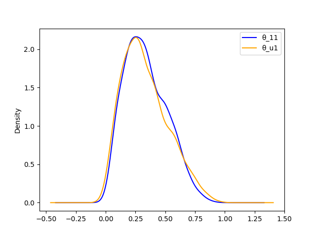
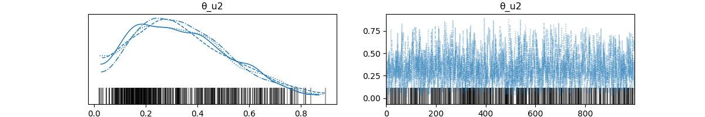

# Chapter 2 Exercises

> Using PyMC, change the parameters of the prior Beta distribution in
> `our_first_model` to match those of the previous chapter. Compare
> the results to the previous chapter.

Our first model was a Bernoulli probability with a uniform 1,1 Beta
prior.

In chapter 1, in addition to the (1,1), we also used a (20,20) and a
(1,4):

Prior plots


Posterior plots - including comparison to analytical posterior.


> Compare the model our_first_model with prior 𝜃∼Beta(1,1)with a model
> with prior 𝜃∼U(0,1). Are the posteriors similar or different? Is
> the sampling slower, faster, or the same? What about using a Uniform
> over a different interval such as [-1, 2]? Does the model run? What
> errors do you get?

A Beta(1,1) _is_ a U(0,1), so it should be the same. I don't think a
[-1,2] uniform will work, because it implies invalid values for p (<0
and > 1)




The bad uniform did work, sort of:



But it warned about 'divergences', and there were black bars on the
trace. I don't know what that means.

```
Sampling 4 chains for 1_000 tune and 1_000 draw iterations (4_000 + 4_000 draws total) took 2 seconds.
There were 500 divergences after tuning. Increase `target_accept` or reparameterize.
```

