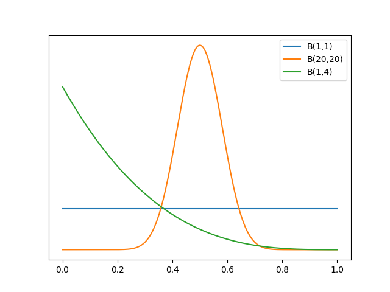
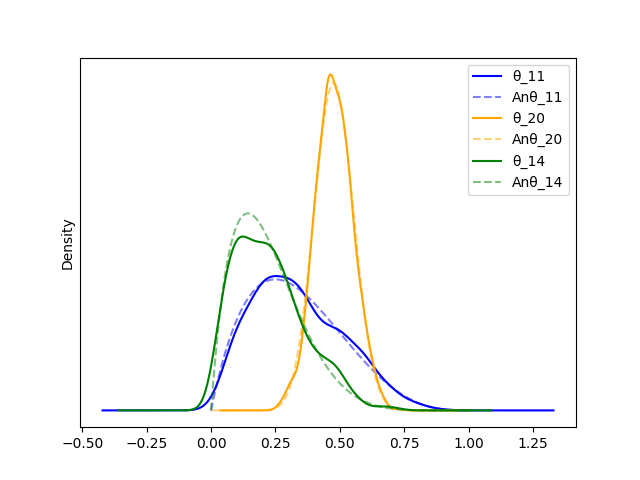

# Chapter 2 Exercises

> Using PyMC, change the parameters of the prior Beta distribution in
> `our_first_model` to match those of the previous chapter. Compare
> the results to the previous chapter.

Our first model was a Bernoulli probability with a uniform 1,1 Beta
prior.

In chapter 1, in addition to the (1,1), we also used a (20,20) and a
(1,4):

Prior plots

Posterior plots - including comparison to analytical posterior.

