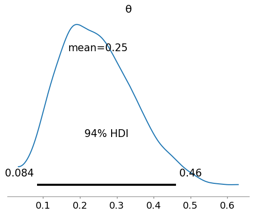

## Chapter 1: Thinking probabilistically

> Probability theory is nothing but common sense reduced to
> calculation. - Pierre Simon Laplace

### 1.1 Stats, models, book approach.

2 types of stats:

- exploratory data analysis (EDA): numerical summaries and visual
  inspection of data.
- Inferential stats: Making statements beyond the current data,
  including making predictions and asserting causation.

Books focuses on latter, but uses some tools from former.

### 1.2 working with data

DEFINITION: Experimental design: the branch of statistics dealing with
data generation/collection.

Data generation is stochastic (noisy). We can _only_ interpret data in
the context of models - mental if not formal.

Book assume's we've already collected the data. Doesn't cover data
munging and stuff like that.

### 1.3 Bayesian modeling

DEFINITION: Model: simplified description of a system or process we
are intereseted in, capturing only the most relevant aspects.

Bayesian modelling process:

1. Given data and assumptions, build a model by combining
   **probability distributions**.
2. Use Bayes' Theorem to add data, **conditioning** the model on the
   data
3. Evaluate and Criticize the model.

Repeat iteratively.

### Probability Primer

DEFINITION: probaility: Given a sample space S and event A which is a
subset of S, a probability is a function P which takes A as an input
and returns a real number between 0 and 1 as output.

DEFINITION: random variable: a function that maps the sample space
into the real numbers $\mathbb{R}$. A simple binary like "Will it rain
tomorrow" might be mapped as "yes" to 1 and "no" to 0. Dice rolls
might map the outcome "1" to the number 1, outcome of "6" to 6 etc.
The random variable function can be 'sampled' (asked) for for values,
and you get a different number representing an outcome of the sample
space each time.

By convention, the variable itself, the function, is represented as a
capital letter. The _outcome_ variable is a lowercase of that same
letter.

DEFINITION: Probability Distribution: A list of all the probabilities
for each outcome in the sample space.

DEFINITION: Emprical Distributions: probability distributions
obtained through repeatedly sampling the random variable - e.g. by
rolling a die.

DEFINITION: Theoretical Distributions: Families of Probability
distributions defined by a mathematical formula (the probability
mass/density function) mapping outcomes to probabilities.

For example, the Beta Binomial is defined by the pmf function.

$$
P(X=x) = \text{pmf}(x) = \left( \frac{n}{x} \right) \frac{B(x+\alpha,n-x+\beta)}{B(\alpha, \beta)}
$$

The alpha and beta here are the _parameters_ of the distribution
family.

Often we will have a theoretical distribution and want to generate
random samples from it, effectively generating an empirical
distribution. Or we will have an Empirical distribution we thing
represents a theoretical distribution family, and we want to figure
out what the parameters of it are.

Conditional probability:

$$
P(A|B) = \frac{P(A,B)}{P(B)}
$$

Bayes' Theorem

$$
p(\theta | Y) = \frac{p(Y|\theta)p(\theta)}{p(y)}
$$

or, `posterior = liklihood * prior / marginal_likelihood`

(Marginal likelihood is sometimes called 'evidence')

### 1.5 Interpreting Probabilities

What does $P(A=\text{true}) = 0.125$ mean? We could think that it means that if we
repeat the scenario A  lots of times, we would expect to see the
outcome 'true' 12.5% of the time. This is the frequentist
interpretation.

The 'subjective' or Bayesian interpretation of a probability is as a
measure of an individual's uncertainty about events.

### 1.6 Probabilities, uncertainty and logic

Under classical logic, statements can take the values of true or
false. The Bayesian interpretation of probability is an extention of
this, one where certainty is a special case.

### 1.7 Single parameter inference

Let's do some Bayesian statistics by hand

The coin flipping problem (aka the BetaBinomial model): we toss a coin
deceral times and record how many heads and tails. Based on this, how
biased is the coin?

We need data and a model. We'll assume the data gathering is done.

First, define our random variable Y: the total number of heads we
observe for some throws.

Next we define our parameter θ as the bias of the coin.

Given we have an independent and identically distributed (iid)
variable, the Binomial distribution is a good fit for modelling the
likelihood.

$$
p(Y|\theta) = \frac{N!}{y!(N-y)!} \theta^y(1-\theta)^{N-y}
$$

For the prior we'll use the Beta:

$$
p(\theta) = \frac{\Gamma(\alpha + \beta)}{\Gamma(\alpha)+\Gamma(\beta)} \theta^{\alpha-1}(1-\theta)^{\beta-1}
$$

Why the Beta?

1. it's restricted to the 0,1 interval, like our θ parameter is
2. it's versatile, it can take several different 'shapes'
3. it's the conjugate prior of the Binomial

Conjugate prior means any posterior from a Beta prior and binomial
likelihood will also be a Beta. This makes it easy to work with
mathematically, because the posterior can be trivially calculated.

$$
p(\theta|Y) = \text{Beta}(\alpha_{\text{prior}}+y, \beta_{\text{prior}}+N-y)
$$

On that 'shapes of Beta' thing: an alpha/beta of 1/1 means a uniform
distribution, 20/20 is gaussian-like centered on 0.5, 1/4 weights the
distribution at 0 and tails off towards the 1. Basically, the bigger
the numbers, the pointer the distribution is, and the more equal the
numbers, the more balanced it is.

The book basically runs this:

```python
prior_params = [(1,1),(20,20),(1,4)]
data = [(0,0),(1,1),(2,1),(3,1),(4,1),(8,4),(16,6),(32,9),(50,13),(150,48)]

for N, y in data:
    print(f"{N} throws, {y} heads")
    for alpha, beta in prior_params:
        print(f"\t with Prior {alpha}, {beta}: {alpha+y}, {beta+N-y}")
```

and plots the PDF of the result. In short, the priors start off very
different and then slowly become more similar as we add data (and thus
confidence). The probability starts to pile up around a value for
theta of 0.35.

The guy calls out the folling important aspects:

1. The result of a Bayesian analysis is a posterior **distribution**,
   not a value.
2. The most probable value is the mode (the peak).
3. The spread of the posterior is proportional to our uncertainty - so
   it gets 'peakier' as we add more certainty
4. Given lots of data, posteriors for differenc priors will ultimately
   converge.
5. Bayes' theorem means that we would get result if we ran the
   algorithm for each trial as it happens as fed it all the data all
   at once.

### 1.8 chosing priors

There are 'non-informative priors' aka flat priors, which have the
minimum possible impact on the posterior. But they can be hard to
derive.

And there are 'weakly informative' priors, which imply we have
_some_ prior understanding of the parameter but not much. For example,
we might just from common sense know the parameter has to take a
positive value.

And there are 'informative priors', that strongly influence the
posterior. These are often used when rigourous data has already been
collected on the paramter.

### 1.9 communicating a bayesian analysis

You can communicate the model you're using in standard probabilistic
notation. The BetaBinomial coinflip model we used above can be written
as:

$$
\theta \sim \text{Beta}(\alpha,\beta)
$$
$$
Y \sim \text{Bin}(n=1,p=\theta)
$$

The result of the analysis - the posterior - can be done using
statistics: expected value (mean/median/mode) and spread (sd/HDI)
measures.

```python
import numpy as np
import arviz as az
import matplotlib.pyplot as plt

az.plot_posterior({'θ': np.random.beta(4, 12, 1000)})
plt.savefig('summarize_posterior.png', dpi=100)
```



## Exercises

### Ex1.1

Suppose you have a jar with 4 jelly beans: 2 are strawberry, 1 is
blueberry, 1 is cinnamon. You draw one jelly bean at random from the
jar.

What is the sample space?

It's the flavor of the jellybean in your hand:
`{strawberry, blueberry, cinnamon}`

We define event A as _the jellybean is strawberry_ and B as _the
jellybean is not cinnamon_. What is `P(A=true)` and `P(B=true)`?

```
P(A=true) = 0.5
P(B=true) = 0.75
```

Are A and B mutually exclusive? Why or why not?

They are not mutually exclusive, because both can be true at the same
time: The Jellybean can be strawberry and not cinnamon at the same
time.

Specifically if the jellybean is strawberry, it's defnitely not
cinnamon. `P(B|A)=1`. But if the bean is not cinnamon, there's an
increased chance it's strawberry: `P(A|B)=2/3`.

### Ex1.2

Previously we defined a Python function P to compute the probability
of an event using the naive definition of probability.

```python
def P(S,A):
    if set(A).issubset(set(S)):
        return len(A)/len(S)
    else:
        return 0

sample_space = ['strawberry', 'strawberry', 'blueberry', 'cinnamon']
P(sample_space, ['strawberry','strawberry']) #=> 0.5
P(sample_space, ['strawberry','strawberry','blueberry']) #=>0.75
```

Generalize that function to compute the probability of events when
they are not all equally likely. Use this new function to compute the
probability of events A and B from the previous exercise.

```python

def P2(S, A, probs):
    if set(A).issubset(set(S)):
        return sum([probs[e] for e in A])
    else:
        return 0

sample_space2 = {'strawberry','blueberry','cinnamon'}
probs = {'strawberry':0.5, 'blueberry':0.25, 'cinnamon':0.25}
P2(sample_space2, {'strawberry'}, probs)
P2(sample_space2, {'blueberry', 'strawberry'}, probs)
```

### Ex1.3

Use preliz to explore different parameters for the BetaBinomial and
Gaussian distributions. Use `plot_pdf`, `plot_cdf` and
`plot_interactive`.

### Ex1.4

