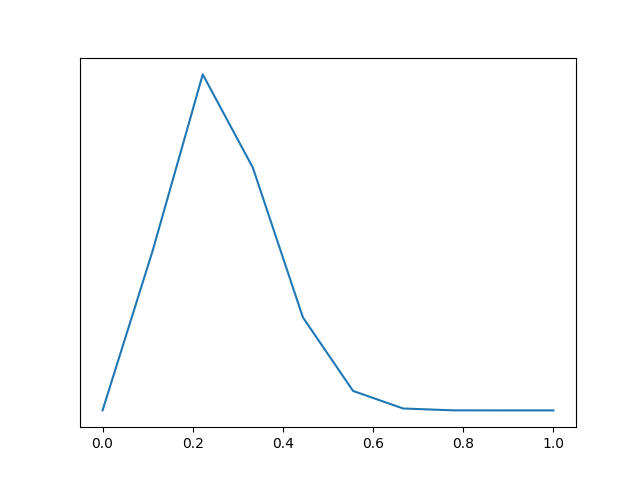

# Chapter 10: Inference methods

The machinery behind inference.

## Grid Method

Simple brute force point-wise: pick a sensible interval and a number
of points n in that interval. For each point in that interval, get the
density of the prior and likelihood and multiply them together.
Normalize if you feel like it.

```python
heads = 3
tails = 10
n = 10

x = np.linspace(0, 1, n)
prior = np.repeat(1/n, n)
likelihood = stats.binom.pmf(heads, heads+tails, x)
posterior = likelihood * prior

plt.plot(x, posterior)
```



The problem is that it doesn't scale with multiple paramters. If your
interval has 4 point for one parameter, an n-parameter model will have
4^n points.
