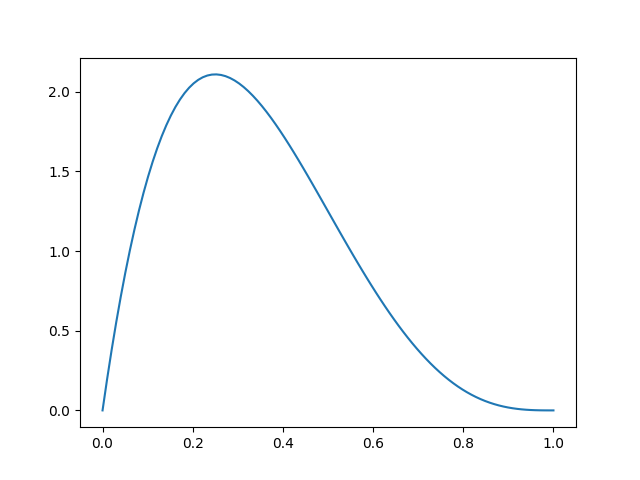
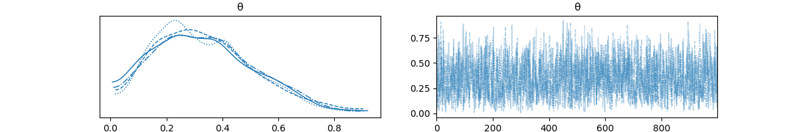

# Chapter 2: Programming Probabilistically

Basic idea: use code to specify models, pymc solves them for us.
Solves, meaning applies Bayes' theorem.

We have knowns (data) and unknowns (random variables, parameters). We
use Bayes' theorem to condition the latter on the former, hopefully
reducing uncertainty about them.

## coin flipping in pymc

In the last chapter we manually ran a Bayes update on a coin
analytically, with a binomial likelihood over a Beta prior.

$$
\theta \sim \text{Beta}(\alpha, \beta)
$$
$$
Y \sim \text{Bin}(\theta)
$$

$$
p(\theta|Y) = \text{Beta}(\alpha_{\text{prior}}+y, \beta_{\text{prior}}+N-y)
$$

Which, with a $\text{Beta}(1,1)$ prior and $N=4$ and $y=1$ results in
a $\text{Beta}(2,4)$ posterior.



Now we do the same thing numerically using pymc by building the model:

```python
with pm.Model() as model:
    θ = pm.Beta('θ', alpha=1, beta=1)
    y = pm.Bernoulli('y', p=θ, observed=data)
    idata = pm.sample(1000)

az.plot_trace(idata)
```




