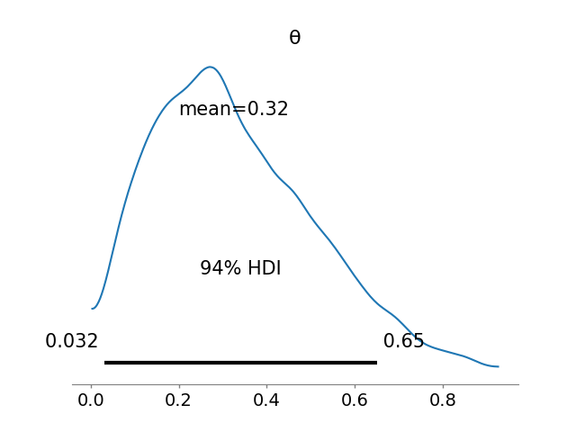

# Chapter 2: Programming Probabilistically

Basic idea: use code to specify models, pymc solves them for us.
Solves, meaning applies Bayes' theorem.

We have knowns (data) and unknowns (random variables, parameters). We
use Bayes' theorem to condition the latter on the former, hopefully
reducing uncertainty about them.

## 2.1 coin flipping in pymc

In the last chapter we manually ran a Bayes update on a coin
analytically, with a binomial likelihood over a Beta prior.

$$
\theta \sim \text{Beta}(\alpha, \beta)
$$
$$
Y \sim \text{Bin}(\theta)
$$

$$
p(\theta|Y) = \text{Beta}(\alpha_{\text{prior}}+y, \beta_{\text{prior}}+N-y)
$$

Which, with a $\text{Beta}(1,1)$ prior and $N=4$ and $y=1$ results in
a $\text{Beta}(2,4)$ posterior.


Now we do the same thing numerically using pymc by building the model:

```python
with pm.Model() as model:
    θ = pm.Beta('θ', alpha=1, beta=1)
    y = pm.Bernoulli('y', p=θ, observed=data)
    idata = pm.sample(1000)

az.plot_posterior(idata)
```




```
   mean    sd  hdi_3%  hdi_97%
θ  0.34  0.18    0.05     0.66
```

The first two lines of the model:


```python
    θ = pm.Beta('θ', alpha=1, beta=1)
    y = pm.Bernoulli('y', p=θ, observed=data)
```

Are a pretty literal translation of the model.

The next line, `idata = pm.sample(1000)`, is the actual inference
happening - in ways we won't talk about yet. What we get out of this
is an `arviz` InferenceData object, with a 1000 long sample from the
inferred posterior distribution.

## 2.2 Summarizing the posterior

Usually, check the posterior first with `az.plot_posterior(idata)` as
above.

But also do `az.plot_trace(idata)`. This will plot FOUR posterior
(behind the scenes, PyMC actually takes 4 independent samples, called
'chains' from the posterior), which should hopefully be pretty
similar. And also on the right a record of all of the samples for the
4 chains.


You can also see summary stats for the posterior with
`az.summary(idata, kind='stats').round(2)`

```
   mean    sd  hdi_3%  hdi_97%
θ  0.34  0.18    0.05     0.66
```

The 94% HDI is telling us "there is a 94% chance the true value of
theta is between 0.05 and 0.66". Which is a pretty big range.

## 2.3 Posterior 
