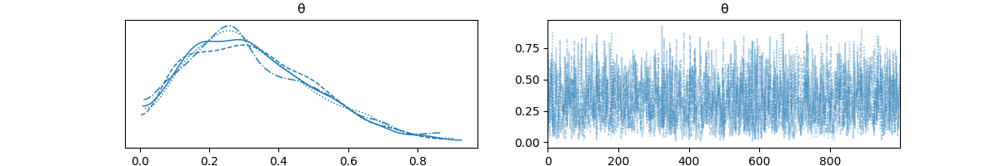
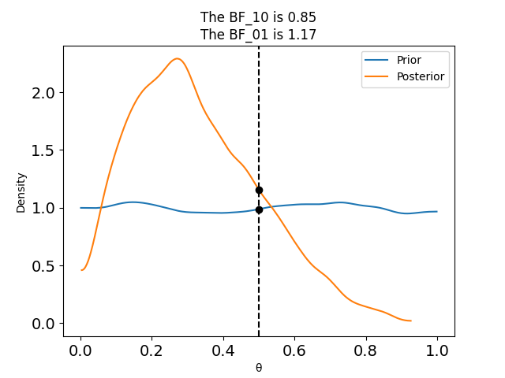
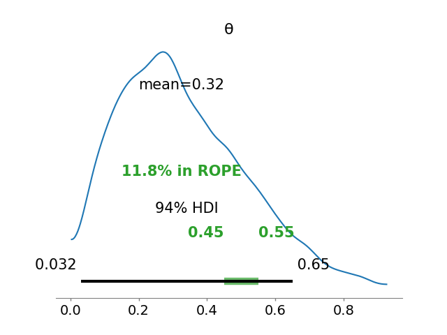
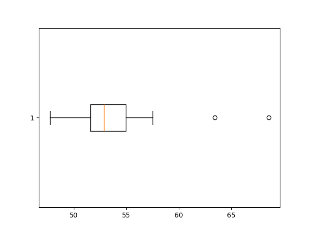
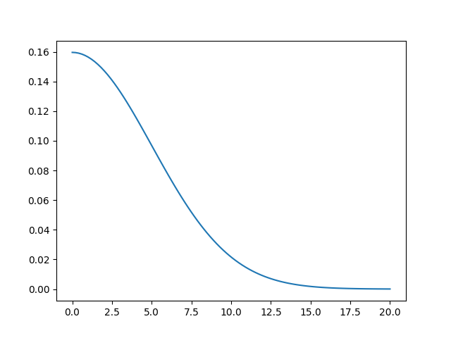
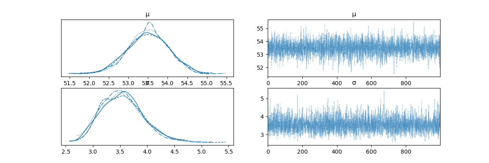
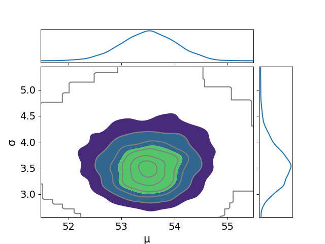
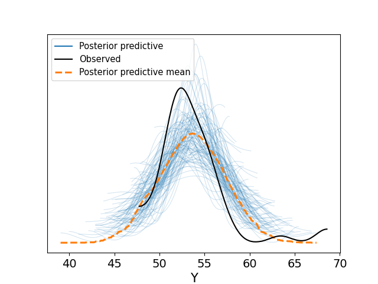
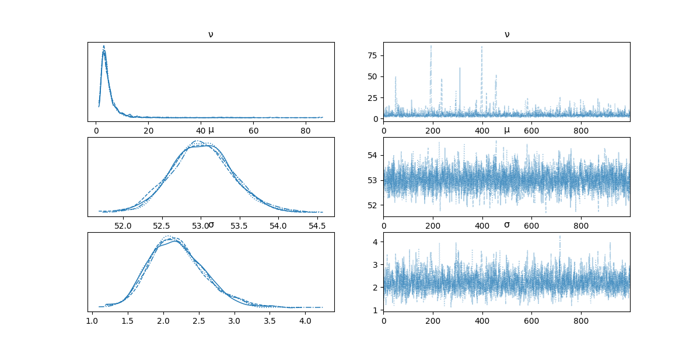
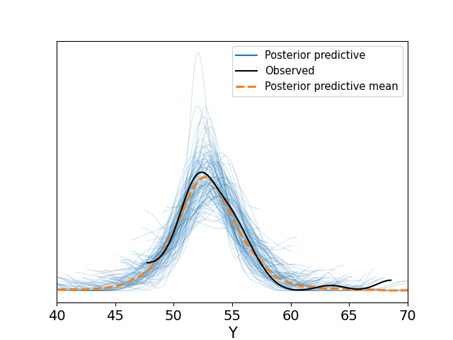

# Chapter 2: Programming Probabilistically

Basic idea: use code to specify models, pymc solves them for us.
Solves, meaning applies Bayes' theorem.

We have knowns (data) and unknowns (random variables, parameters). We
use Bayes' theorem to condition the latter on the former, hopefully
reducing uncertainty about them.

## 2.1 coin flipping in pymc

In the last chapter we manually ran a Bayes update on a coin
analytically, with a binomial likelihood over a Beta prior.

$$
\theta \sim \text{Beta}(\alpha, \beta)
$$
$$
Y \sim \text{Bin}(\theta)
$$

$$
p(\theta|Y) = \text{Beta}(\alpha_{\text{prior}}+y, \beta_{\text{prior}}+N-y)
$$

Which, with a $\text{Beta}(1,1)$ prior and $N=4$ and $y=1$ results in
a $\text{Beta}(2,4)$ posterior.


Now we do the same thing numerically using pymc by building the model:

```python
with pm.Model() as model:
    θ = pm.Beta('θ', alpha=1, beta=1)
    y = pm.Bernoulli('y', p=θ, observed=data)
    idata = pm.sample(1000)

az.plot_posterior(idata)
```


```
   mean    sd  hdi_3%  hdi_97%
θ  0.34  0.18    0.05     0.66
```

The first two lines of the model:


```python
    θ = pm.Beta('θ', alpha=1, beta=1)
    y = pm.Bernoulli('y', p=θ, observed=data)
```

Are a pretty literal translation of the model.

The next line, `idata = pm.sample(1000)`, is the actual inference
happening - in ways we won't talk about yet. What we get out of this
is an `arviz` InferenceData object, with a 1000 long sample from the
inferred posterior distribution.

## 2.2 Summarizing the posterior

Usually, check the posterior first with `az.plot_posterior(idata)` as
above.

But also do `az.plot_trace(idata)`. This will plot FOUR posterior
(behind the scenes, PyMC actually takes 4 independent samples, called
'chains' from the posterior), which should hopefully be pretty
similar. And also on the right a record of all of the samples for the
4 chains.



You can also see summary stats for the posterior with
`az.summary(idata, kind='stats').round(2)`

```
   mean    sd  hdi_3%  hdi_97%
θ  0.34  0.18    0.05     0.66
```

The 94% HDI is telling us "there is a 94% chance the true value of
theta is between 0.05 and 0.66". Which is a pretty big range.

## 2.3 Posterior-based decisions

Is this coin fair? A fair coin is one with a theta of 0.5. The HDI
goes to 0.66, so 0.5 is in the range, so we can't rule it out. To
reduce our uncertainty, we need more data or a more informative prior.

### Savage-Dickey

The **Savage-Dickey** density ratio is a comparison is a comparison of
the density of the prior and posterior at a reference value - here
0.5.

```python
az.plot_bf(idata, var_name='θ', prior=np.random.uniform(0,1,10000), ref_val=0.5)
```



The numbers presented at the top are **Bayes Factors**.

The BF_01 of 1.28 means that the value of $\theta = 0.5$ is 1.28 times
more likely under the posterior than the prior. The BF_10 is just
`1/BF_01`, and means the value of theta _not_ being equal to 0.5 is
0.78 times more likely under the posterior than the prior.

A Bayes Factor under 3 is basically meaningless. Greater than 10 is
strong. Greater than 100 is decisive.

### ROPE

The Region of Practical Equivalence (ROPE) is an interval which we
decide means that, if our model suggests the value is in that region,
that's good enough. For the coin example, we might say that if our
model suggests the value of theta is between 0.45 and 0.55, then we
can conclude it's a fair coin.

Specifically, if the HDI is within the ROPE, we'd conclude it's fair.
If the HDI doesn't overlap the ROPE at all, it's not fair. If there's
an overlap, we don't know.

```python
az.plot_posterior(idata, rope=[0.45, 0.55])
```



## Loss Functions and point estimates

So far we've got ranges for theta, and some methods and rules of thumb
for comparing the range to a point value or another range. But we
don't have any way of actually making a point estimate: What value do
we think theta is?

This means collapsing the posterior points using a mathematical
function, but there are lots (really, infinite) ways to do that. These
functions are called **loss functions**. The details are boring, but
two popular ones are the absolute loss function and quadratic loss
function. These correspond to taking the median and mean respectively,
so just get those.

The important thing is that if you're doing a point estimate you need
to be cognizant that you are _choosing_ a method over others, and you
should have a reason for doing that.

Loss functions can be _asymmetric_, meaning they can overweight the
benifits of being right against the risks being wrong. But obviously
you need to be very careful about this.

## Gaussians

Gaussians describe many real-world things because of the Central Limit
Theorem - when you measure the average of something, the average will
be Normally distributed.

Consider a dataset of 48 'chemical shift' values (what a chemical
shift is is not important).




The median is about 53, the IQR is 50-52. There are 2 outliers at 63
and 69 ish.

Assume the Gaussian is a good description of the data. The mean and sd
are unknown. We give a uniform prior for the mean, and a half-normal
for the SD.

$$
\mu \sim U(l,h)
$$
$$
\sigma \sim HN(\sigma_\sigma)
$$
$$
Y \sim N(\mu,\sigma)
$$

(A half-normal is the absolute values of a normal centered on 0, like this)



```python
with pm.Model() as model:
    μ = pm.Uniform('μ', lower=40, upper=70)
    σ = pm.HalfNormal('σ', sigma=5)
    Y = pm.Normal('Y', mu=μ, sigma=σ, observed=data)
    idata = pm.sample()

az.plot_trace(idata)
az.plot_pair(idata, kind='kde', marginals=True)
```




```
    mean    sd  hdi_3%  hdi_97%
μ  53.50  0.52   52.55    54.50
σ   3.54  0.38    2.87     4.26
```

## Posterior Predictive Checks

We can use the posterior to generate predictive datapoints.

$$
p(\tilde{Y} | Y) = \int{p(\tilde{Y} | \theta)p(\theta|Y)d\theta}
$$

$\tilde{Y}$ is the Posterior Predictive Distribution.

```python
pm.sample_posterior_predictive(idata, model, extend_inferencedata=True)
az.plot_ppc(idata, num_pp_samples=100)
```

e

The peak of the PP mean is off to the right. And the variance is
larger for the simulated data.

So what now? Is the model good?

We've got these two outliers, which would be very, very unusual in a
normal distribution. If our posterior mean is 53.5 and sd is 3.54, the
largest outlier of 68.58 is `(68.58-53.5)/3.54` is over 4 sd from the
mean. These outliers are why the mean is skewed to the right of the
observed data.

We could declare these outliers and remove them. Two common rules of
thumb are that any point which is 1.5 times the IQR from each
quartile, or more than 2 or 3 sds away is an outlier.

Or, we can adjust the model. The Student's T distribution is a
generalization of the normal which adds a parameter $\nu$ (the
'normality' or 'degrees of freedom' parameter) for the 'fatness' of
the tails. The lower the value, the fatter the tails. A $\nu$ of ∞ is
the normal. $\nu$ of 1 is the Cauchy/Lorentz distribution.

A normality of less than 1 is technically possible, but the tails are
so fat that it's not really sensical to talk about the means.

```python
with pm.Model() as model_t:
    ν = pm.Exponential('ν', 1/30)
    μ = pm.Uniform('μ', lower=40, upper=75)
    σ = pm.HalfNormal('σ', sigma=10)
    Y = pm.StudentT('Y', mu=μ, sigma=σ, nu=ν, observed=data)
    idata_t = pm.sample()
```




```
    mean    sd  hdi_3%  hdi_97%
ν   4.72  4.52    1.07     9.59
μ  53.02  0.39   52.27    53.74
σ   2.20  0.40    1.51     2.97
```

cf. the normal model stats:

```
    mean    sd  hdi_3%  hdi_97%
μ  53.50  0.52   52.55    54.50
σ   3.54  0.38    2.87     4.26
```

The mean is sort of the same. The sigma is very different, it went
down quite a lot. Nu is also nearly 5 - a very fat-tailed
distribution.

A way to think about this is that, while the normal will react to
outliers by 'pulling' the mean towards them and growing the SD, the
student's T will instead grow Nu.

Note that the sigma in Student T is _not_ strictly the SD, it's the
_scale_. However for values of Nu > 2, scale is a reasonable proxy for
SD.

