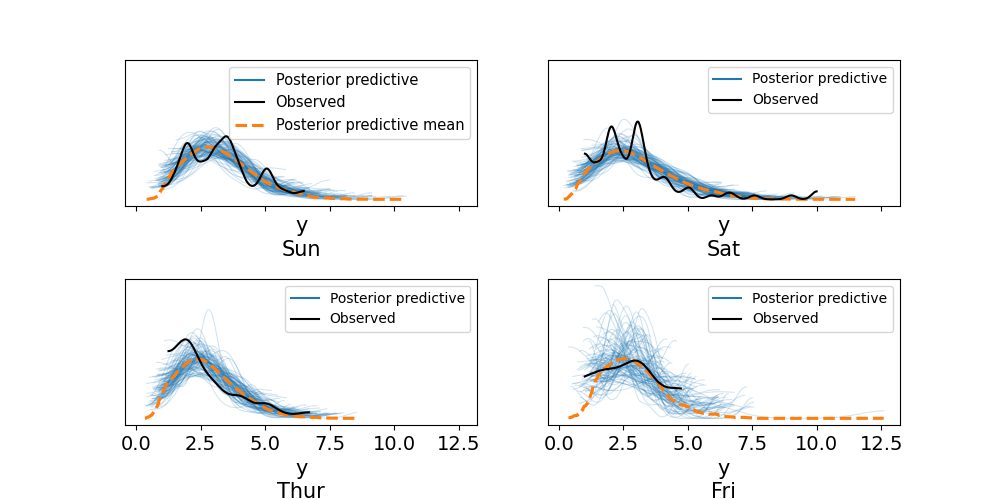

# Chapter 2 part 8: Groups comparison

- how well patients respond to a certain drug
- reduction of car accidents by introduction of new traffic
  regaulations
- student performance under different teaching approaches

'Hypothesis testing': finding 'statistically significant' result. Problematic:

- stat significance is not practical significance.
- Small effects can be declared significant just by collecting enough data.
- Based on p-values, which are often used and interpreted in the wrong way

Alternative: effect size, quantifying the difference between two groups. Not a
'yes-no' question. 'How large is the effect'.

The tips dataset:

```
     total_bill   tip     sex smoker   day    time  size
239       29.03  5.92    Male     No   Sat  Dinner     3
240       27.18  2.00  Female    Yes   Sat  Dinner     2
241       22.67  2.00    Male    Yes   Sat  Dinner     2
242       17.82  1.75    Male     No   Sat  Dinner     2
243       18.78  3.00  Female     No  Thur  Dinner     2
```

We'll look at day and tip size.

```python
tips = pd.read_csv('data/tips.csv')
tip = tips['tip'].values

categories = np.array(['Thur', 'Fri', 'Sat', 'Sun'])
idx = pd.Categorical(tips['day'], categories=categories).codes
coords = {'days': categories, 'days_flat': categories[idx]}
# categories[idx] is an array of strings equivalent to the 'day' column of the
# input dataset

with pm.Model(coords=coords) as model:
    μ = pm.HalfNormal('μ', sigma=5, dims='days')
    σ = pm.HalfNormal('σ', sigma=1, dims='days')
    y = pm.Gamma('y', mu=μ[idx], sigma=σ[idx], observed=tip, dims='days_flat')
    idata = pm.sample()
    idata.extend(pm.sample_posterior_predictive(idata))

_, axes = plt.subplots(2, 2)
az.plot_ppc(idata, num_pp_samples=100, coords={'days_flat':[categories]},flatten=[], ax=axes)
```



The question we want to answer is: what is the effect size of the day on the tip
size?

**Cohen's d** is a common method to measure effect size: The difference in means
scaled by the pooled standard deviation. The pooled SD recognizes that a
datasets with smaller variance should result in a larger effect size than one
where the spread is large.

$$
\frac{\mu_2-\mu_1}{\sqrt{\frac{\sigma_1^2+\sigma_2^2}{2}}}
$$

This is stated in point terms, but it works equally well on the distributions of
μ and σ we have.

A D of 0.5 would be a difference of 0.5 standard deviations from one group to
the other.

**Probability of Superiority** is another measure of effect size. It's the
probability that a point taken at random from one group has a larger value than
a point taken at random from the other. Mathematically it's:

$$
\text{ps}=\Phi \left(\frac{\delta}{\sqrt{2}}\right)
$$

where δ is Cohen's d, and Φ is the Cumulative Normal distribution.

Or you can do it empirically by drawing from the posterior samples. Which is
probably better.

